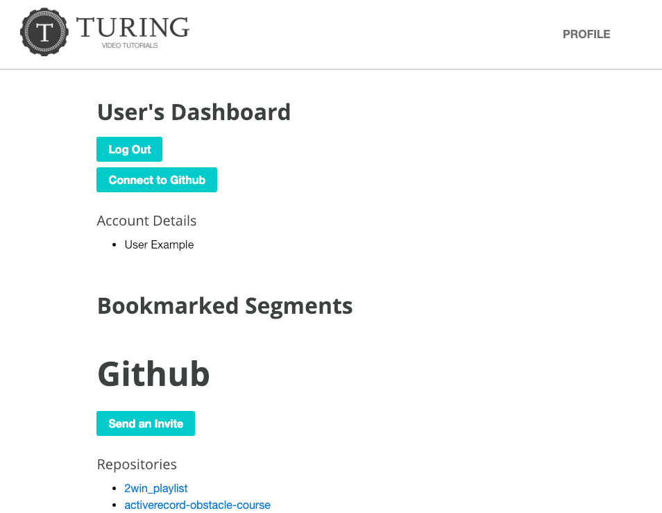
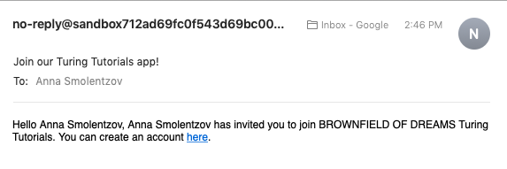

# Brownfield Of Dreams: Turing Tutorials

Brownfield of Dreams: Turing Tutorials is a paired student project for Module 3 of the Back-End Engineering Program at the [Turing School of Software & Design](https://turing.io). The project specifications can be found [here](https://github.com/turingschool-examples/brownfield-of-dreams). Up until now, projects have been primarily been built from scratch: "greenfield" projects. This project presents us with an existing code base to which we are asked to add features: a "brownfield" project. 
You can see our beautifully deployed site [here on Heroku](https://limitless-brook-80568.herokuapp.com/). 



## Features
#### Content, Login, and Administrator Privileges
The project is based on a Ruby on Rails application called "Turing Tutorials" where visitors can see tutorials, or collections of Youtube videos, of Turing-related content for online learning. Administrators on the site can log in and create and edit tutorials, as well as add tags. Visitors can create an account on the page. Once logged in, they can bookmark tutorials, as well as see tutorials marked "classroom-content only". 

#### OAuth to GitHub and Consuming the GitHub API
Users can connect to their GitHub account using OAuth. Once connected, they see information from their GitHub account on their Dashboard page, including Repositories, Followers, and users they are following. If users in their Followers or Following lists also have accounts on the Turing Tutorials website, an "Add as Friend" button appears next to that person's username. 

#### Sending Emails from the Site
Emails are enabled using [Mailgun](https://www.mailgun.com/). Emails may be sent from the site in two ways: 
* When a user creates an account, an authorization email is sent for them to validate their account.
* A user who is connected to GitHub can invite friends from GitHub to join the Turing Tutorials site by entering their friend's GitHub username into a form. If the friend has a public email on GitHub, our site sends them an email invitation. 



### Learning Goals
* Learn to consume a JSON API
* Build an app that authenticates using OAuth
* Make API calls to an authenticated API
* Build on top of brownfield code
* Empathy for developers facing deadlines
* Empathy for teammates that might work with your code in the future (or future you!)
* Prioritize what code is relevant to your immediate task (and ignore the rest)
* Send email from a Rails application

## Installation
### Local Setup
If you wish to install our app locally, you can fork or clone the repository here. Installation steps once cloned are as follows: 
Install the gem packages
```
$ bundle install
```

Install node packages for stimulus
```
$ brew install node
$ brew install yarn
$ yarn add stimulus
```

Set up the database
```
$ rake db:create
$ rake db:migrate
$ rake db:seed
```

### Running Tests
Once the app is installed locally, you can run the test suite: 
```
bundle exec rspec
```

### Set up Environment Variables
You will need an API key from Youtube, as well as a user token from Github for the tests to pass. These will need to be set up as the following environment variables: 
```
ENV[YOUTUBE_API_KEY]
ENV[GITHUB_TOKEN]
```

## Built With: Technologies and Versions
* [Ruby 2.4.1](https://ruby-doc.org/core-2.4.1/)
* [Rails 5.2.2](https://guides.rubyonrails.org/)
* [GitHub Projects for Project Management](https://help.github.com/articles/about-project-boards/)
* [Faraday](https://github.com/lostisland/faraday)
* [OmniAuth GitHub](https://github.com/omniauth/omniauth-github)
* [Mailgun](https://www.mailgun.com/)
* [Heroku](https://www.heroku.com/)
* [RSpec](http://rspec.info/)
* [Capybara](https://github.com/teamcapybara/capybara/blob/3.12_stable/README.md)
* [vcr](https://github.com/vcr/vcr)
* [Stimulus](https://github.com/stimulusjs/stimulus)
* [will_paginate](https://github.com/mislav/will_paginate)
* [acts-as-taggable-on](https://github.com/mbleigh/acts-as-taggable-on)
* [webpacker](https://github.com/rails/webpacker)
* [selenium-webdriver](https://www.seleniumhq.org/docs/03_webdriver.jsp)
* [chromedriver-helper](http://chromedriver.chromium.org/)

## Authors
**[Maddie Jones](https://github.com/maddyg91)**

**[Anna Smolentzov](https://github.com/maddyg91)**

## Acknowledgements
We would like to thank our fantastic Mod 3 instructors [Mike](https://github.com/mikedao) and [Sal](https://github.com/s-espinosa) for your help with this project and in general at Turing!